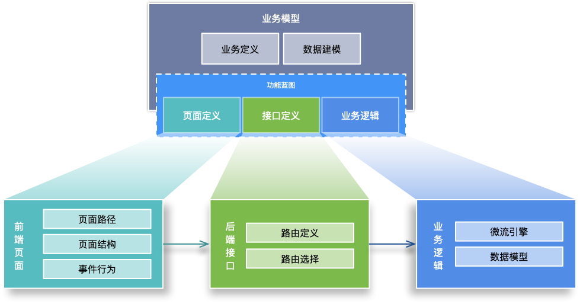

# 业务模型

业务模型是潮汐栈最接近业务语言的核心模型。它描述一个业务对象及其标准能力，并可以投射为数据、页面、接口、菜单、权限、逻辑流和审批流等运行资产。

## 作用

- 以客户、合同、订单、请假单等业务对象为中心统一建模。
- 让字段、关系、视图、接口和访问控制围绕同一业务语义协作。
- 通过投影管道生成标准页面、数据访问和 API，减少重复配置。
- 为融合开发保留稳定的业务边界，扩展代码只补充模型未覆盖的能力。

## 核心属性

| 属性 | 作用 | 说明 |
| --- | --- | --- |
| `formatVersion` | 定义格式版本 | 识别模型文档的结构版本。 |
| `modelType` | 模型类型 | 区分标准业务模型、复合视图等业务模型形态。 |
| `name` / `namespace` | 模型标识 | 组成模型的稳定全名，供数据、接口和页面引用。 |
| `title` / `description` | 业务说明 | 面向开发者和用户解释模型含义。 |
| `fields` | 字段集合 | 描述业务对象属性、类型、默认值和约束。 |
| `relations` | 关系集合 | 描述引用、拥有、组合和子集合等对象关系。 |
| `features` | 能力开关 | 控制列表、表单、详情、导入导出等标准能力。 |
| `apis` | 业务操作 | 描述模型对外提供的标准或自定义 API。 |
| `views` | 页面视图 | 描述列表、详情、编辑等视图如何生成或覆盖。 |
| `workflow` | 流程绑定 | 关联业务操作所需的逻辑流或审批流。 |
| `accessControl` | 访问控制 | 描述业务对象和动作的权限、数据范围协作信息。 |
| `isEnabled` / `custom` | 状态与扩展 | 控制启用状态并承载受约束的扩展属性。 |

## 与其他模型的关系

- [数据模型](../data-model/) 承载字段、主键、关系和查询；业务模型可以投射或关联它，但不等于数据库表。
- [字段定义](../field-define/) 提供可复用字段类型，[数据字典模型](../data-dict-model/) 提供受控值域。
- [UI 模型](../ui-model/) 和 [UI Schema](../ui-schema/) 把业务对象呈现为页面。
- [WebAPI 模型](../webapi-model/) 暴露业务操作，[逻辑流模型](../logicflow-model/) 承接自动处理。
- [审批流模型](../approval-workflow-model/) 处理需要人员参与的长流程。
- [模块模型](../module-model/)、[菜单模型](../menu-model/) 和 [权限模型](../authority-model/) 负责组织、暴露和治理。

## 投影与生命周期

业务模型不是多个下游模型的复制粘贴源，而是通过平台的投影管道形成结果集合。保存、提交、发布和运行时刷新是不同阶段：保存模型不会自动等同于发布页面、部署审批流或启用运行实例。

一个业务模型的最小验证闭环是：保存并提交模型，确认数据字段和关系有效，验证标准页面和 API，再用目标角色检查菜单、权限和关键业务动作。

## 何时不要用业务模型

- 只需要一次性采集且没有长期业务关系时，考虑动态表单和 UI Schema。
- 只需要一个通用配置项时，使用 [配置模型](../configuration-model/)。
- 只需要受控枚举值时，使用 [数据字典模型](../data-dict-model/)。

## 使用入口与契约

- 操作入口：[开发业务模型](../../guide/tutorial/business-model/develop-business-model/) · [从需求到交付](../../low-code/from-requirement-to-delivery)
- Schema：`business.schema.json`，完整索引见 [JSON Schema 参考](../../reference/jsonschema/)。
