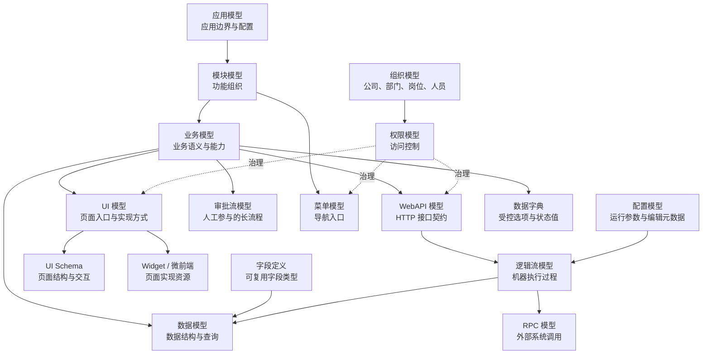

# 核心概念与模型地图

潮汐栈把应用、业务定义、数据结构、页面入口、接口契约、执行过程和治理边界分开建模，再在运行时装配成应用。模型是平台能力的稳定契约；开发菜单、编辑器和运行时服务都是这些模型的不同消费入口。

本页是模型概念的唯一总入口。要查某个模型的详细作用、属性、关系和使用入口，直接进入下面的对应页面；要查所有 metadata 文件格式，再进入 [JSON Schema 参考](../reference/jsonschema/)。

## 应用如何形成

业务模型是大多数业务交付的语义中心，但不是所有模型的上游：应用和模块提供容器，组织和权限提供治理，配置和字典提供运行支撑，页面、接口和流程模型分别承载自己的契约。

## 模型分组

### 应用与组织

| 模型 | 解决的问题 | 详细页面 |
| --- | --- | --- |
| 应用模型 | 一个应用有哪些基本身份、入口和主题配置 | [应用模型](./application-model/) |
| 模块模型 | 功能和模型如何组织成模块树 | [模块模型](./module-model/) |
| 组织模型 | 公司、部门、岗位、员工和任职关系是什么 | [组织模型](./organization-model/) |

### 业务与数据

| 模型 | 解决的问题 | 详细页面 |
| --- | --- | --- |
| 业务模型 | 业务对象有哪些字段、关系、动作和标准能力 | [业务模型](./business-model/) |
| 数据模型 | 数据如何存储、校验、查询和扩展 | [数据模型](./data-model/) |
| 字段定义 | 一类字段如何复用存储、校验和展示规则 | [字段定义](./field-define/) |
| 数据字典模型 | 状态、分类和枚举值如何统一维护 | [数据字典模型](./data-dict-model/) |

### 页面与接口

| 模型 | 解决的问题 | 详细页面 |
| --- | --- | --- |
| UI 模型 | 页面入口是什么、由什么方式实现 | [UI 模型](./ui-model/) |
| UI Schema 模型 | 页面组件、数据绑定和交互如何声明 | [UI Schema 模型](./ui-schema/) |
| Widget 模型 | 可复用页面组件的配置、预览和约束是什么 | [Widget 模型](./widget-model/) |
| 微前端模型 | 独立前端应用从哪里加载、如何接入 | [微前端模型](./micro-web-model/) |
| WebAPI 模型 | HTTP 接口的路径、参数、响应和安全契约是什么 | [WebAPI 模型](./webapi-model/) |

### 流程与集成

| 模型 | 解决的问题 | 详细页面 |
| --- | --- | --- |
| 逻辑流模型 | 系统自动执行哪些节点和分支 | [逻辑流模型](./logicflow-model/) |
| 审批流模型 | 人员如何申请、审批、驳回和流转 | [审批流模型](./approval-workflow-model/) |
| RPC 模型 | 如何调用外部系统及其认证方式 | [RPC 模型](./rpc-model/) |

### 导航与治理

| 模型 | 解决的问题 | 详细页面 |
| --- | --- | --- |
| 菜单模型 | 用户从哪个导航入口进入能力 | [菜单模型](./menu-model/) |
| 权限模型 | 谁可以访问页面、菜单、接口和数据 | [权限模型](./authority-model/) |
| 配置模型 | 哪些运行参数可配置、如何校验和编辑 | [配置模型](./configuration-model/) |

## 典型装配链路

### 交付一个长期维护的业务对象

1. 用 [应用模型](./application-model/) 和 [模块模型](./module-model/) 确认应用边界与归属。
2. 用 [业务模型](./business-model/) 定义对象、字段、关系和动作。
3. 检查生成或关联的 [数据模型](./data-model/)，必要时补充 [字段定义](./field-define/) 和 [数据字典模型](./data-dict-model/)。
4. 用 [UI 模型](./ui-model/) 暴露页面入口，用 [UI Schema 模型](./ui-schema/) 或标准视图实现页面。
5. 用 [WebAPI 模型](./webapi-model/) 定义接口，用 [逻辑流模型](./logicflow-model/) 承接自动处理。
6. 用 [菜单模型](./menu-model/) 组织导航，用 [权限模型](./authority-model/) 限制访问。

### 需要人工参与的业务过程

以业务模型作为业务数据载体，以 [审批流模型](./approval-workflow-model/) 描述参与人、节点和状态；通过 [组织模型](./organization-model/) 提供人员与岗位上下文，通过 [权限模型](./authority-model/) 控制发起、处理和查看范围。审批前后的自动写入、通知或集成再交给逻辑流、通知和 RPC 资源。

### 需要接入外部系统

先用 [WebAPI 模型](./webapi-model/) 定义平台自身接口边界，再用 [RPC 模型](./rpc-model/) 描述外部调用；短流程组合用逻辑流，复杂协议或专用 SDK 进入 [融合开发](../fusion-development/)。

## 模型与支撑资源的边界

不是每一种 metadata 都是独立的核心模型。通知模板、定时任务、消息队列绑定、业务日志、国际化和数据初始化等资源，依附于模型或运行链路提供交付能力。它们的作用、属性、关系和 Schema 见 [平台支撑资源](./supporting-resources/)。

## 不要混淆的边界

- 业务模型描述业务语义，数据模型描述数据结构；业务模型可以投射数据模型，但两者不是同一个对象。
- UI 模型描述入口和实现方式，UI Schema 描述页面内容；微前端是 UI 模型的另一种实现资源。
- 菜单模型负责导航，权限模型负责访问边界；菜单可见不等于接口和数据一定可访问。
- 逻辑流负责机器执行，审批流负责人员参与的长流程；审批流中的自动动作可以调用逻辑流。
- 字段定义和数据字典提供可复用值语义，但不替代业务模型。

## 扩展边界

新增字段类型、表达式、脚本上下文、逻辑流节点、页面组件、微前端或处理器时，必须通过对应扩展点注册。扩展实现补充模型能力，不绕过模型、菜单、权限或运行时装配机制。
