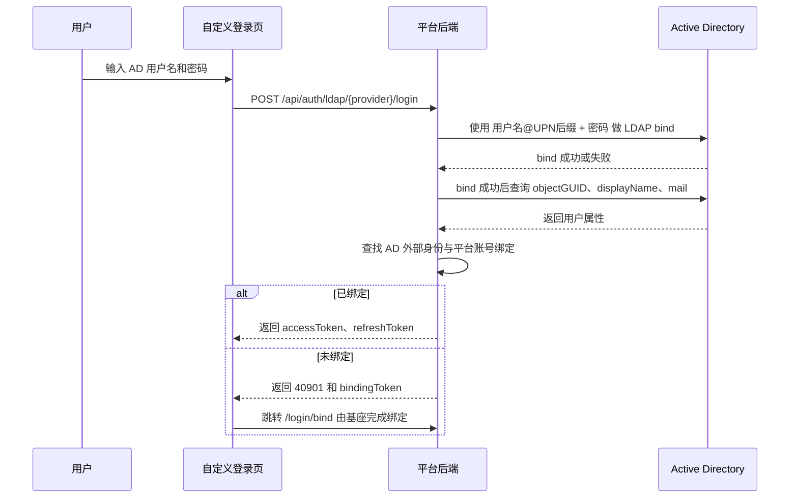

# AD 域认证方式适配指南

本文面向需要把企业 Microsoft Active Directory 接入潮汐栈登录体系的实施、后端、前端和运维团队。它覆盖从 AD 信息收集、后端 LDAP bind 配置、自定义登录页开发、联调排障到最终用户使用说明的完整路径。

本文讨论的是 **LDAP bind** 方式：用户在登录页输入 AD 用户名和密码，平台服务端使用这组凭据向 AD 完成认证。它不是 Windows 本机域登录，也不是 Kerberos、NTLM 或 SPNEGO 单点登录。

## 适用范围

适用于以下场景：

- 用户希望用企业 AD 账号登录平台。
- 登录页需要同时展示本地账号、AD 账号、CAS、OAuth2 或 OIDC 等多种登录方式。
- 后端希望用用户输入的用户名密码直接向 AD 验证，不额外配置只读查询账号。
- 管理员可以提供域控地址、AD 域名、证书链和基本目录信息。

不适用于以下场景：

- 用户已登录 Windows 后访问平台，浏览器自动完成免密登录。
- 需要 Kerberos、NTLM 或 SPNEGO 协商认证。
- 需要平台自动通过 DNS SRV 完成域控发现和 RootDSE 探测。

## 认证流程

AD 域接入推荐使用 `adDirectBind` 模式。这个模式不需要只读查询账号，认证过程接近 Windows 域账号密码验证体验。



关键点：

- 密码校验由 AD 完成，平台不保存 AD 密码。
- `adDirectBind` 使用用户自己的凭据 bind，不需要配置 `searchBindDn` 或 `searchBindPasswordRef`。
- bind 成功后仍需要查询用户属性，平台用 `objectGUID` 这类稳定 ID 绑定 AD 账号和平台账号。

## 向 AD 管理员收集信息

接入前建议向 AD 管理员确认以下信息。

| 信息 | 示例 | 用途 |
| --- | --- | --- |
| AD DNS 域名 | `corp.example.com` | 推导 Base DN，作为 UPN 后缀 |
| 域控地址 | `dc01.corp.example.com` | 组成 LDAP/LDAPS URL |
| LDAPS 端口 | `636` | 推荐使用加密连接 |
| Base DN | `DC=corp,DC=example,DC=com` | bind 成功后搜索用户属性 |
| UPN 后缀 | `corp.example.com` 或 `example.com` | 拼接 `username@domain` |
| NetBIOS 域名 | `CORP` | 仅当使用 `CORP\username` 时需要 |
| 稳定用户 ID 属性 | `objectGUID` | 外部身份绑定主键 |
| 展示属性 | `displayName`、`mail` | 平台用户展示和绑定提示 |
| 企业 CA 证书 | 根证书或中间证书 | 让 JVM 信任 AD 的 LDAPS 证书 |
| 用户查询权限 | 普通用户是否可读取自身属性 | 确认 `adDirectBind` 是否可查询属性 |

如果企业允许普通域用户读取自身 `objectGUID`、`displayName`、`mail`，优先使用无只读账号的 `adDirectBind`。如果不允许，改用 `search` 模式并配置只读服务账号。

## AD 配置规律

### Base DN 推导

AD DNS 域名通常可以直接推导为 Base DN。

```text
corp.example.com -> DC=corp,DC=example,DC=com
example.com -> DC=example,DC=com
ad.company.local -> DC=ad,DC=company,DC=local
```

推导规则是把域名按 `.` 拆分，每段转换为一个 `DC=`。

### UPN 与 NetBIOS

AD 常见两种登录名格式：

```text
zhangsan@corp.example.com
CORP\zhangsan
```

推荐使用 UPN 方式：

- 用户可以输入 `zhangsan`，平台拼成 `zhangsan@corp.example.com`。
- 用户也可以直接输入完整 UPN。
- 只需要知道 DNS 域名或 UPN 后缀。

只有企业明确要求 `CORP\zhangsan` 时，才使用 NetBIOS 模式。NetBIOS 域名不能总是从 DNS 域名可靠推导，必须向管理员确认。

### 域控地址发现

Windows 加域时会通过 DNS SRV 发现域控。当前平台配置不自动发现域控，但实施人员可以用同样的 DNS 记录人工查询：

```bash
nslookup -type=SRV _ldap._tcp.dc._msdcs.corp.example.com
```

或：

```bash
dig SRV _ldap._tcp.dc._msdcs.corp.example.com
```

返回的主机名通常就是域控，例如：

```text
dc01.corp.example.com
dc02.corp.example.com
```

配置时优先使用 LDAPS：

```yaml
urls:
  - ldaps://dc01.corp.example.com:636
  - ldaps://dc02.corp.example.com:636
```

## 后端配置指南

### 推荐配置：AD direct bind

这是最接近“只输入 AD 用户名密码验证”的配置方式。

```yaml
ouroboros:
  security:
    external-auth:
      ldap:
        - key: ad-default
          type: ldap
          display-name: 企业 AD
          enabled: true

          urls:
            - ldaps://dc01.corp.example.com:636
            - ldaps://dc02.corp.example.com:636

          base-dn: DC=corp,DC=example,DC=com
          mode: adDirectBind

          domain: corp.example.com
          login-id-mode: USER_PRINCIPAL_NAME

          search-filter: "(&(objectCategory=person)(objectClass=user)(!(objectClass=computer))(!(userAccountControl:1.2.840.113556.1.4.803:=2))(sAMAccountName={0}))"

          external-id-attribute: objectGUID
          attribute-mapping:
            displayName: displayName
            mail: email
            sAMAccountName: username
            userPrincipalName: userPrincipalName

      external-call:
        ldap:
          connect-timeout: 5s
          read-timeout: 10s
```

字段说明：

| 字段 | 推荐值 | 说明 |
| --- | --- | --- |
| `key` | `ad-default` | 前端调用 LDAP 登录时使用的 provider 标识 |
| `type` | `ldap` | 固定值，表示 LDAP/AD 直连认证 |
| `display-name` | `企业 AD` | 登录页展示名称 |
| `urls` | `ldaps://dc01...:636` | 域控 LDAPS 地址，推荐配置多个 |
| `base-dn` | `DC=corp,DC=example,DC=com` | 查询用户属性的搜索根 |
| `mode` | `adDirectBind` | 使用用户输入的账号密码直接 bind |
| `domain` | `corp.example.com` | UPN 后缀；裸用户名会拼成 `username@domain` |
| `login-id-mode` | `USER_PRINCIPAL_NAME` | 使用 UPN 方式 bind |
| `search-filter` | 见示例 | bind 成功后查询用户属性 |
| `external-id-attribute` | `objectGUID` | 平台绑定 AD 用户的稳定 ID |
| `attribute-mapping` | 见示例 | 将 AD 属性映射成平台外部身份属性 |

### 用户名输入规则

使用上面的配置时，推荐登录页提示用户输入：

```text
AD 用户名，例如 zhangsan 或 zhangsan@corp.example.com
```

后端行为：

- 输入 `zhangsan`：按 `zhangsan@corp.example.com` bind。
- 输入 `zhangsan@corp.example.com`：直接按完整 UPN bind。
- 输入 `CORP\zhangsan`：当前配置不推荐，除非改用 NetBIOS 模式。

### NetBIOS 模式

如果企业要求使用 `CORP\zhangsan`，配置改为：

```yaml
mode: adDirectBind
domain: CORP
login-id-mode: SAM_ACCOUNT_NAME
search-filter: "(sAMAccountName={0})"
```

这时 `domain` 填 NetBIOS 域名，不填 DNS 域名。

### UPN 后缀与 AD DNS 域名不同

很多企业的 AD 域是：

```text
corp.local
```

但用户实际登录名是：

```text
zhangsan@example.com
```

这时配置应分开：

```yaml
base-dn: DC=corp,DC=local
domain: example.com
login-id-mode: USER_PRINCIPAL_NAME
```

`base-dn` 反映 AD 目录域，`domain` 反映用户 UPN 后缀。

### 备用配置：search 模式

如果 AD 不允许普通用户读取自身属性，或 `adDirectBind` bind 成功后无法搜索到用户，可以改用 `search` 模式。

```yaml
ouroboros:
  security:
    external-auth:
      ldap:
        - key: ad-default
          type: ldap
          display-name: 企业 AD
          enabled: true
          urls:
            - ldaps://dc01.corp.example.com:636
          base-dn: DC=corp,DC=example,DC=com
          mode: search
          search-bind-dn: svc_ouroboros@corp.example.com
          search-bind-password-ref: env:LDAP_BIND_PASSWORD
          search-filter: "(&(objectCategory=person)(objectClass=user)(!(objectClass=computer))(!(userAccountControl:1.2.840.113556.1.4.803:=2))(|(sAMAccountName={0})(userPrincipalName={0})))"
          login-id-mode: AUTO
          external-id-attribute: objectGUID
          attribute-mapping:
            displayName: displayName
            mail: email
```

部署环境中配置服务账号密码：

```bash
LDAP_BIND_PASSWORD='服务账号密码'
```

`search` 模式的服务账号只用于搜索用户 DN 和读取属性，不用于验证用户密码。用户密码仍然通过用户 DN bind 进行校验。

### 本地账号密码登录开关

如果希望登录页只展示 AD 登录，可以关闭本地账号密码登录：

```yaml
security:
  auth:
    login:
      localPassword:
        enabled: false
```

关闭本地登录不影响 LDAP 登录。LDAP 仍然需要用户名密码表单，因为 LDAP bind 本身就是凭据型登录。

### LDAPS 证书

推荐使用 `ldaps://...:636`。如果 AD 使用企业自签 CA，需将 CA 证书导入后端 JVM truststore，或在运行环境中提供可信证书链。

可用下面命令检查证书链：

```bash
openssl s_client -connect dc01.corp.example.com:636 -showcerts
```

如果 Java 报 PKIX、certificate_unknown 或 unable to find valid certification path，说明 JVM 还不信任该证书链。

## 前端自定义登录页开发指南

### 登录方式组织

自定义登录页建议拆成两个区块：

- 账号密码区：本地账号、AD/LDAP 账号。
- 跳转登录区：CAS、OAuth2、OIDC。

LDAP provider 的 `loginUrl` 是 `null`，这是正常的。前端不能把 LDAP 当成点击跳转按钮处理，应调用 `loginWithLdap()`。

### 获取 provider 和登录开关

```ts
import {
  isLocalPasswordLoginEnabled,
  listExternalProviders,
} from 'ouroboros-sdk'

const localEnabled = isLocalPasswordLoginEnabled()
const providers = await listExternalProviders()

const ldapProviders = providers.filter((provider: any) => provider.type === 'ldap')
const redirectProviders = providers.filter((provider: any) =>
  provider.type === 'cas' || provider.type === 'oauth2'
)
```

推荐交互：

- 本地登录和 AD 登录同时存在时，默认选中本地账号。
- 只有 AD 登录时，直接展示 AD 用户名密码表单，不显示模式切换器。
- AD provider 不健康时，展示 provider 但禁用提交按钮，并提示联系管理员。

### 提交 AD 登录

```ts
import {
  loginWithLdap,
  mapAuthError,
  resolveReturnUrl,
} from 'ouroboros-sdk'

export async function submitAdLogin(providerKey: string, username: string, password: string) {
  try {
    const result = await loginWithLdap({
      provider: providerKey,
      username,
      password,
    })

    if (result?.bindingRequired && result?.bindingToken) {
      const returnUrl = resolveReturnUrl(window.location.pathname + window.location.search)
      const search = new URLSearchParams({ token: result.bindingToken })
      if (returnUrl !== '/') {
        search.set('returnUrl', returnUrl)
      }
      window.location.assign(`/login/bind?${search.toString()}`)
      return
    }

    return result
  } catch (error: any) {
    const code = error?.response?.data?.code || error?.code
    throw new Error(mapAuthError(code))
  }
}
```

### 发起跳转式登录

```ts
import { resolveReturnUrl, startRedirectLogin } from 'ouroboros-sdk'

export function submitRedirectLogin(provider: any) {
  return startRedirectLogin(
    provider,
    resolveReturnUrl(window.location.pathname + window.location.search)
  )
}
```

### 登录页文案建议

AD 登录区建议使用明确的用户语言：

| 场景 | 推荐文案 |
| --- | --- |
| 模式名称 | 企业 AD |
| 用户名占位 | 请输入 AD 用户名，例如 zhangsan |
| 密码占位 | 请输入 AD 密码 |
| 提交按钮 | AD 登录 |
| 首次绑定提示 | 首次使用 AD 账号登录，需要绑定平台账号 |
| 错误兜底 | AD 登录失败，请检查账号密码或联系管理员 |

如果企业要求完整 UPN，则占位文案改为：

```text
请输入 AD 用户名，例如 zhangsan@example.com
```

### 与基座页面的边界

自定义登录页只负责 `/login` 的展示和发起登录：

- `/login/callback` 由基座处理跳转式登录回调。
- `/login/bind` 由基座处理外部账号绑定。
- 自定义登录页不需要保存 AD 密码。
- 自定义登录页不应自行拼接平台 token 到 URL。

## 配置后的调试指南

### 第一步：确认网络和证书

在平台后端所在机器上检查域控连通性：

```bash
nc -vz dc01.corp.example.com 636
```

检查 LDAPS 证书：

```bash
openssl s_client -connect dc01.corp.example.com:636 -showcerts
```

如果端口不通，先处理网络、防火墙或域控访问策略。如果证书不可信，先导入企业 CA。

### 第二步：确认 Base DN 和用户搜索

如果环境有 `ldapsearch`，可用用户 UPN 测试 bind 和搜索：

```bash
ldapsearch \
  -H ldaps://dc01.corp.example.com:636 \
  -D 'zhangsan@corp.example.com' \
  -W \
  -b 'DC=corp,DC=example,DC=com' \
  '(&(objectCategory=person)(objectClass=user)(sAMAccountName=zhangsan))' \
  objectGUID displayName mail userPrincipalName
```

预期能返回且只返回一个用户。如果返回 0 条，重点检查：

- `base-dn` 是否过窄或拼错。
- 用户是否不在该 OU 下。
- `search-filter` 使用的属性是否符合企业规则。
- UPN 后缀是否和 AD DNS 域不同。

### 第三步：确认 provider 列表

启动平台后，请求 provider 列表：

```bash
curl -s http://localhost:8080/api/auth/providers
```

预期能看到：

```json
{
  "success": true,
  "data": [
    {
      "key": "ad-default",
      "type": "ldap",
      "displayName": "企业 AD",
      "loginUrl": null,
      "availability": "healthy"
    }
  ]
}
```

排查方向：

- 没有 `ad-default`：检查配置是否加载、`enabled` 是否为 `true`、启动日志是否有配置校验错误。
- `availability` 不是 `healthy`：检查域控连通性和 LDAPS 证书。
- `loginUrl` 为 `null`：这是 LDAP provider 的预期结果，不是错误。

### 第四步：直接调用 LDAP 登录接口

用测试账号调用：

```bash
curl -s \
  -X POST \
  -H 'Content-Type: application/json' \
  http://localhost:8080/api/auth/ldap/ad-default/login \
  -d '{"username":"zhangsan","password":"用户AD密码"}'
```

可能结果：

| 结果 | 含义 | 下一步 |
| --- | --- | --- |
| 返回 `accessToken`、`refreshToken` | 登录成功且已绑定平台账号 | 继续验证前端登录 |
| 返回 `40901` 和 `bindingToken` | AD 验证成功，但尚未绑定平台账号 | 跳转 `/login/bind?token=...` 完成绑定 |
| 返回 `40101` 或 `40104` | 用户名密码错误或身份校验失败 | 检查账号、密码、登录名格式 |
| 返回 `50201` | provider 不存在、不可用或 AD 连接失败 | 检查配置、网络、证书和后端日志 |

### 第五步：验证自定义登录页

在浏览器中打开 `/login`，检查：

- 能看到 AD 登录方式。
- AD 登录按钮不是跳转式 SSO 按钮。
- 本地登录关闭时，AD 用户名密码表单仍保留。
- AD 首次登录后能进入 `/login/bind`。
- 绑定后再次登录能直接进入平台。

浏览器开发者工具中重点看：

- `GET /api/auth/providers` 是否返回 AD provider。
- `POST /api/auth/ldap/ad-default/login` 请求体是否包含 `username` 和 `password`。
- 登录失败时是否展示 `mapAuthError()` 映射后的用户文案。

### 常见问题

| 问题 | 常见原因 | 处理方式 |
| --- | --- | --- |
| `Provider not found or unavailable` | provider key 配错、配置未加载、provider 启动不可用 | 对齐前端 `providerKey` 与后端 `key`，检查启动日志 |
| `LDAP connection error` | 域控不可达、LDAPS 证书不可信、端口错误 | 检查网络和 JVM truststore |
| 用户密码正确但登录失败 | `domain` 或 `login-id-mode` 不匹配 | 确认使用 UPN 还是 NetBIOS |
| bind 成功但查不到属性 | `base-dn` 或 `search-filter` 不匹配 | 用 `ldapsearch` 验证搜索条件 |
| 首次登录进入绑定页 | 正常行为，AD 身份尚未绑定平台账号 | 使用平台账号完成绑定 |
| 每次登录都要求绑定 | `external-id-attribute` 变化或绑定记录未保存 | 固定使用 `objectGUID`，检查绑定数据 |
| AD 禁用账号还能搜索到 | 过滤器未排除禁用账号 | 增加 `userAccountControl` 禁用过滤 |

## 用户使用指南

### 首次使用 AD 登录

1. 打开平台登录页。
2. 选择 **企业 AD** 或管理员配置的 AD 登录名称。
3. 输入 AD 用户名和密码。
4. 点击 **AD 登录**。
5. 如果系统提示绑定平台账号，输入已有平台账号和密码完成绑定。
6. 绑定成功后进入平台。

首次绑定只需要做一次。以后使用同一个 AD 账号登录时，会直接进入平台。

### 日常登录

1. 打开平台登录页。
2. 选择 **企业 AD**。
3. 输入 AD 用户名和密码。
4. 点击 **AD 登录**。

用户名格式以登录页提示为准，常见格式是：

```text
zhangsan
```

或：

```text
zhangsan@corp.example.com
```

### 用户侧常见问题

| 用户看到的问题 | 说明 | 建议操作 |
| --- | --- | --- |
| 账号或密码错误 | AD 拒绝了当前凭据 | 确认使用 AD 密码，不是平台本地密码 |
| 需要绑定平台账号 | 首次用 AD 登录 | 输入已有平台账号完成绑定 |
| 外部认证服务不可用 | 平台暂时无法连接 AD | 联系管理员 |
| 登录后没有权限 | 登录成功但平台角色权限不足 | 联系平台管理员分配角色 |

## 上线检查清单

### 后端

- [ ] 使用 `ldaps://` 连接域控。
- [ ] JVM 信任 AD 证书链。
- [ ] `base-dn` 能覆盖目标用户。
- [ ] `mode` 使用 `adDirectBind`，除非明确需要 `search`。
- [ ] `login-id-mode` 与用户输入格式一致。
- [ ] `external-id-attribute` 使用 `objectGUID`。
- [ ] `GET /api/auth/providers` 能返回健康的 `ldap` provider。
- [ ] `POST /api/auth/ldap/{provider}/login` 能返回 token 或 `40901`。

### 前端

- [ ] AD 登录位于账号密码区。
- [ ] LDAP provider 不按 `loginUrl` 跳转。
- [ ] 本地登录关闭时仍展示 AD 登录表单。
- [ ] `40901` 能跳转到 `/login/bind`。
- [ ] 错误码能映射成用户可理解的文案。
- [ ] 登录页文案说明用户名格式。

### 运维和用户支持

- [ ] 管理员知道如何检查域控连通性和证书问题。
- [ ] 用户知道首次登录需要绑定平台账号。
- [ ] 服务台知道区分 AD 密码错误、平台账号绑定失败和平台权限不足。
- [ ] 已准备回退方式，例如临时启用本地管理员账号登录。

## 相关文档

- [自定义登录页与认证接入](./custom-login-page-and-auth-integration)
- [平台自定义登录页集成指南](../guide/advance/extend-frontend/micro-app/custom-login-integration)
- [前端基座 SDK 功能方法](../api/frontend/sdk/completion-methods)
