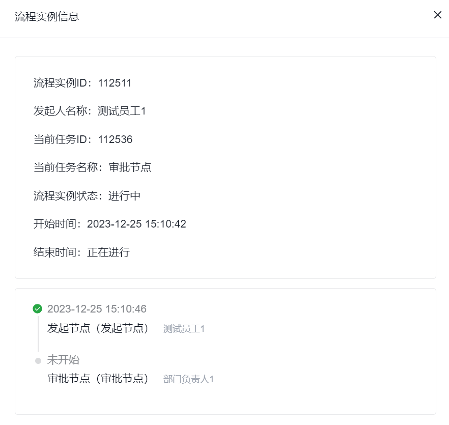

# 审批流统计

审批流统计用于从管理视角查看流程执行情况、审批实例和异常终止情况。

适合：

- 关注审批效率和执行量的管理人员
- 需要定位具体实例问题的运维或业务支持人员

如果你当前的目标是“我手上有哪些待办、我该批什么”，这页通常不是第一入口，而应该优先回到 [审批中心](../approval-center/)。审批流统计更偏整体观察和事后排查，而不是日常逐条处理。

## 先理解这页和审批中心的区别

- **审批中心** 解决“当前审批人现在要处理什么”
- **审批流统计** 解决“整条流程最近跑得怎么样、哪里卡住了、哪一批实例出了异常”

这两页常常会看同一批流程实例，但关注角度完全不同：一个偏执行，一个偏治理。

## 使用顺序

1. 在流程统计列表查看执行量、处理中数量和异常数量。
2. 进入目标流程的实例列表，按状态或时间定位异常范围。
3. 打开实例详情，检查当前节点、处理人和审批时间线。
4. 只有确认实例无法继续且业务影响已处理后，才执行强制结束。

## 页面概览

## 你通常会在这里完成什么

- 查看某类审批流程近期的执行量和处理情况
- 进入单条流程的实例列表，判断是否存在集中卡点
- 打开具体实例，查看时间线和当前状态
- 在管理介入场景下终止异常实例

## 常见任务

### 查看流程统计列表

统计列表页通常支持加载更多、导出 Excel，以及进入某条流程的实例明细。

第一次看列表时，建议优先盯这几类信息：

- 哪些流程执行量明显高
- 哪些流程长期处于处理中
- 哪些流程异常终止或人工结束较多

这样比一上来逐条翻实例更容易判断问题是不是“流程设计层面”还是“某个具体单据层面”。

### 查看流程执行明细

进入某个流程后，可以查看该流程的所有申请实例；明细列表的数据通常与该流程的**总申请数**对应。

流程执行明细示例如下：

当前页面还包含以下功能：

#### 加载更多与导出 Excel

实例明细列表同样通常支持继续加载和导出。

#### 查看实例详情

进入实例详情后，可以看到当前申请的基本信息和审批时间线。

流程执行详情示例如下：

#### 强制结束

:::warning
强制结束会直接中断当前流程实例，通常更适合在异常处理、测试清理或管理介入场景下使用；正式业务场景中建议先确认影响范围。
:::

## 常见判断

### 为什么统计里有实例，但审批中心没人处理

优先从下面几种情况排查：

1. 流程已经结束，只是仍然保留在统计里
2. 当前节点没有流转到你预期的审批人
3. 实例进入了异常状态或被人工终止
4. 你当前关注的是管理视角统计，不等于某个审批人的个人待办

### 为什么某条流程执行量正常，但业务仍说“审批很慢”

统计页更适合帮助你判断“慢”发生在哪一层：

- 是整体流程都慢，还是只有某类实例慢
- 是卡在同一个审批节点，还是分散在不同节点
- 是流程本身设计复杂，还是组织、权限、通知等上游条件没准备好

如果你发现问题已经不只是个别实例，而是某一类流程长期卡在同样位置，通常要回到 [审批流管理](../approval-management/) 重新看流程设计，而不是只在统计页做人工处理。
