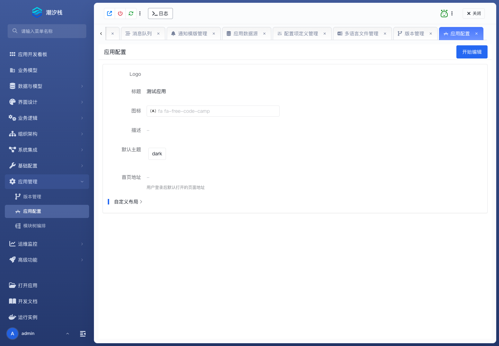

# 应用配置

## 功能简介

应用配置维护应用名称、描述、图标等基础信息。

## 与其他模块的关系

- 应用配置影响打开应用列表、运行入口和用户识别应用的方式。
- 它通常在创建应用后先设置，再继续模型和页面开发。

## 如何操作

1. 进入“应用管理 / 应用配置”。
2. 修改基础信息。
3. 回到打开应用或运行实例检查展示效果。

## 截图

## 相关功能

- [版本管理](./version-management)
- [模块树编排](./module-arrangement)
