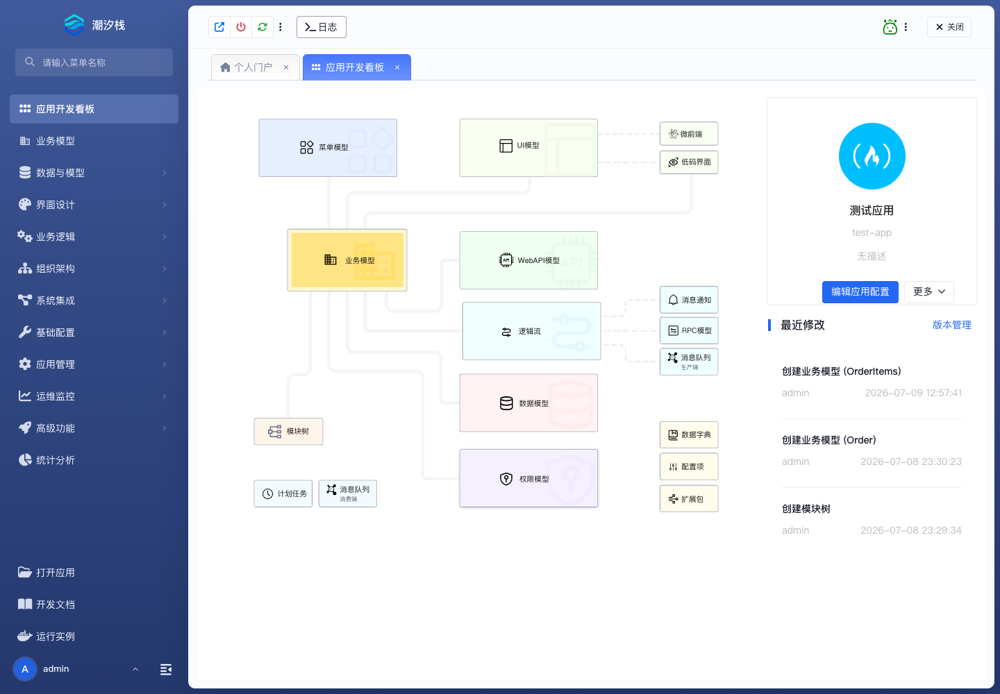

# 应用开发看板

## 功能简介

应用开发看板集中展示应用资产、最近变更和常用开发入口。

## 与其他模块的关系

- 看板把业务模型、数据模型、逻辑流、UI 模型、Web API、模块树等关键资产放在同一视图中。
- 它适合在进入具体菜单前判断应用现状，也适合从最近修改记录回到正在调整的模型或配置。

## 如何操作

1. 打开应用后默认进入“应用开发看板”。
2. 查看资产入口、应用信息和最近修改。
3. 点击看板中的快捷入口或左侧菜单继续进入具体模块。

## 截图

## 相关功能

- [打开应用](./open-apps)
