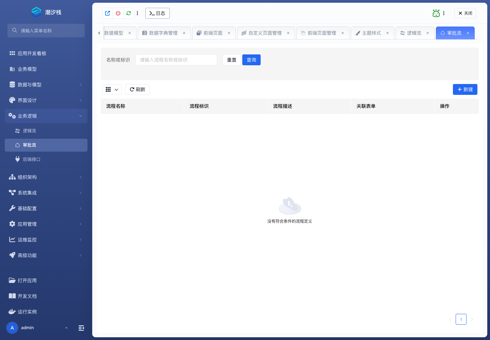

# 审批流

## 功能简介

审批流设计人工审批、候选人、节点权限、表单权限和审批结果。

## 与其他模块的关系

- 审批流通常与业务模型、动态表单、组织角色和消息通知模板组合成审批闭环。
- 它承接人工处理语义，逻辑流更适合承接系统自动处理。

## 如何操作

1. 进入“业务逻辑 / 审批流”。
2. 创建流程定义并配置节点、候选人和表单权限。
3. 发布流程并绑定到业务入口。

## 截图

## 相关功能

- [逻辑流](./logicflow)
- [后端接口](./backend-api)
