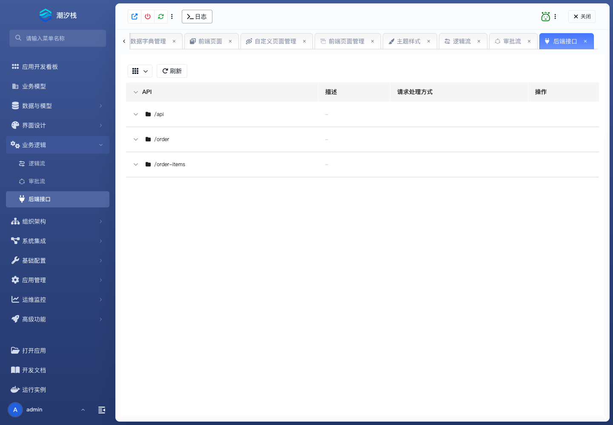

# 后端接口

**后端接口** 管理应用中已经被平台发现的 Web API，并切换其处理器。它不用于任意创建新的 HTTP 方法和路径。

## 使用步骤

1. 进入 **业务逻辑 / 后端接口**，按方法和路径找到目标 API。
2. 核对范围：内部、开放或公开。
3. 点击 **切换处理方式**，选择逻辑流、`RequestMapping` 或 `RouterFunction`。
4. 选择逻辑流时填写逻辑流名称；选择 `RequestMapping` 时核对类名和方法名。
5. 保存后调用该接口，核对状态码、响应和业务结果。
6. 需要恢复发现时的处理器时点击 **复原**，再调用一次验证。

成功标志：指定方法和路径由选定处理器响应；复原后恢复原处理方式。

需要新增代码接口时使用正式后端扩展包，见 [创建后端扩展包](../../fusion-development/backend-extension-packages)。
