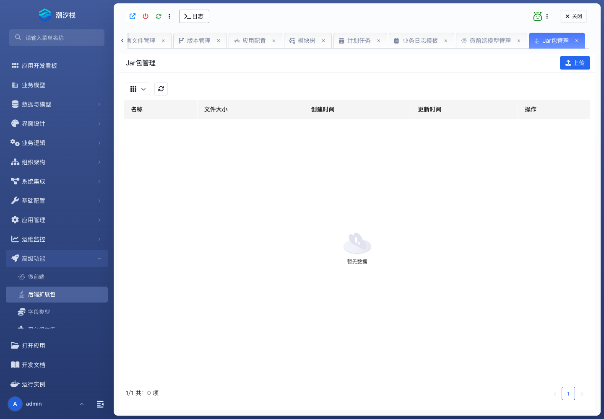

# 后端扩展包

## 功能简介

后端扩展包管理应用级后端扩展能力。

## 与其他模块的关系

- 后端扩展包可承接自定义字段、服务能力、集成适配和标准能力外的业务逻辑。
- 它与字段类型、后端接口和逻辑流扩展协同。

## 如何操作

1. 进入“高级功能 / 后端扩展包”。
2. 上传或维护扩展包。
3. 由相关模型、接口或运行时能力加载使用。

## 截图

## 相关功能

- [微前端](./micro-frontend)
- [字段类型](./field-type)
- [平台组件库](./component-library)
