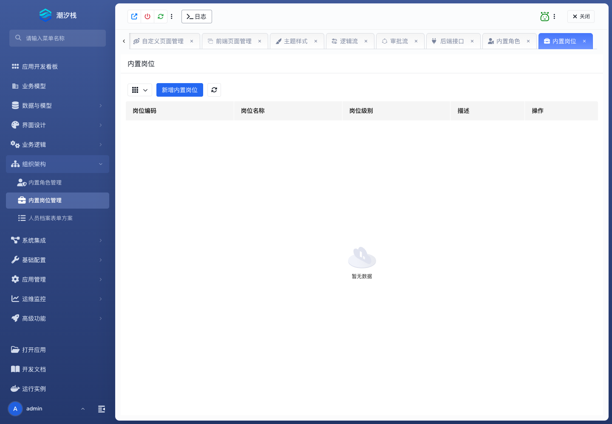

# 内置岗位管理

## 功能简介

内置岗位管理维护应用内岗位，用于表达组织中的职能分工。

## 与其他模块的关系

- 岗位可辅助人员档案、审批候选人和业务分派配置。
- 它与角色不同，更偏组织职责；角色更偏权限集合。

## 如何操作

1. 进入“组织架构 / 内置岗位管理”。
2. 维护岗位。
3. 结合人员档案或审批配置使用岗位。

## 截图

## 相关功能

- [内置角色管理](./builtin-role)
- [人员档案表单方案](./personnel-profile-form)
