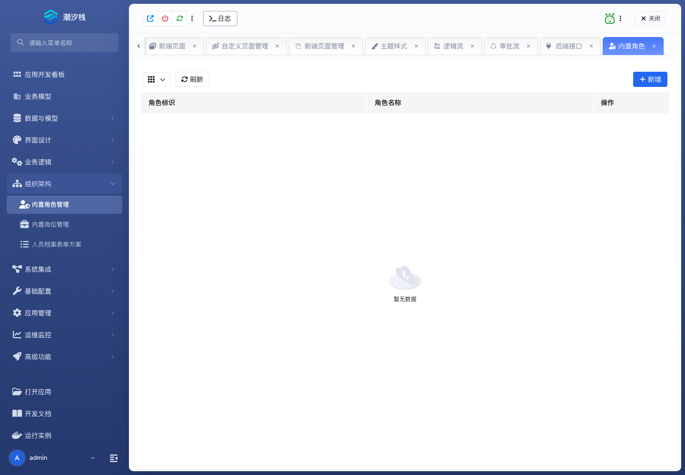

# 内置角色管理

## 功能简介

内置角色管理维护应用内角色，支撑菜单、页面、接口和数据访问授权。

## 与其他模块的关系

- 角色会被权限配置、模块树入口、接口访问控制和审批候选人解析使用。
- 它与人员档案、岗位和组织结构共同构成身份边界。

## 如何操作

1. 进入“组织架构 / 内置角色管理”。
2. 创建或维护角色。
3. 在页面、接口、数据范围或流程候选人中引用角色。

## 截图

## 相关功能

- [内置岗位管理](./builtin-position)
- [人员档案表单方案](./personnel-profile-form)
