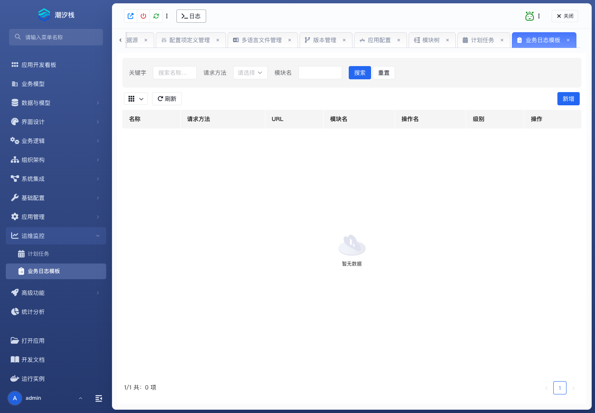

# 业务日志模板

## 功能简介

业务日志模板规范应用内业务日志记录口径。

## 与其他模块的关系

- 业务日志模板与业务动作、接口调用、审批处理和审计回看相关。
- 它让不同模块记录的日志保持统一语义。

## 如何操作

1. 进入“运维监控 / 业务日志模板”。
2. 维护日志模板。
3. 在业务操作或接口中记录审计信息。

## 截图

## 相关功能

- [计划任务](./scheduled-task)
