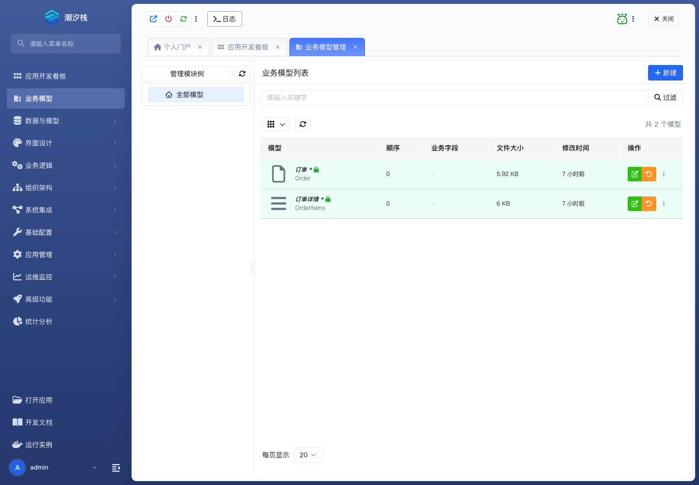

# 业务模型

## 功能简介

业务模型描述业务对象、字段、关系、视图、接口和访问控制，是标准业务功能交付的核心资产。

## 与其他模块的关系

- 业务模型通常连接数据模型、数据字典、前端页面、后端接口、权限和流程。
- 它上承需求对象，下接页面生成、接口开放、审批和逻辑流编排。

## 如何操作

1. 进入“业务模型”。
2. 新建或打开业务模型。
3. 按需要维护字段、关系、视图、接口、访问控制和自定义能力。

## 截图

## 相关功能

- [数据模型](./data-model)
- [数据字典](./data-dictionary)
