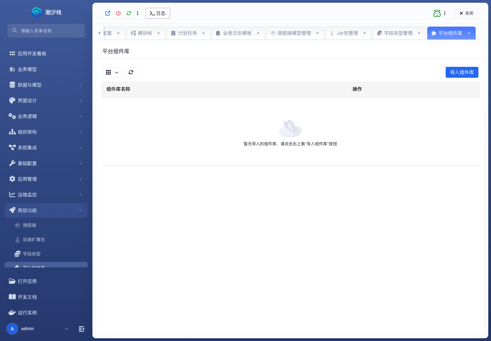

# 平台组件库

平台组件库把一组前端组件安装到平台，再由应用按需导入。适合跨应用分发渲染器、表单项、动作或编辑器插件。

## 使用步骤

1. 准备 ZIP，包内必须包含 `components.manifest.json`。
2. 确认版本高于已安装版本，`publicPath` 不与其他组件库冲突。
3. 进入 **高级功能 / 平台组件库**，上传并安装 ZIP。
4. 打开测试应用，点击 **导入组件库**。
5. 在页面设计器中确认组件可选并完成渲染验证。
6. 移除前先清理应用内引用；没有应用引用后才能从平台卸载。

成功标志：导入该库的应用可以使用组件，未导入的应用不受影响；平台拒绝卸载仍被引用的版本。

包结构、升级和卸载步骤见 [工作台、Widget 与平台组件库](../../fusion-development/workbench-widgets-and-component-libraries)。
