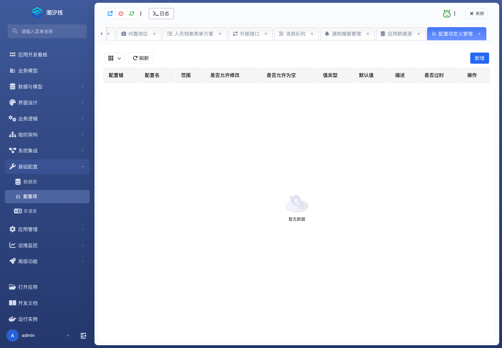

# 配置项

## 功能简介

配置项维护应用级参数、开关、默认值和运行配置。

## 与其他模块的关系

- 配置项可被逻辑流、后端接口、页面和业务规则读取。
- 它用于替代硬编码参数，使运行策略可调整。

## 如何操作

1. 进入“基础配置 / 配置项”。
2. 创建配置项并设置默认值。
3. 在逻辑流、接口或页面中读取配置。

## 截图

## 相关功能

- [数据源](./datasource)
- [多语言](./i18n)
