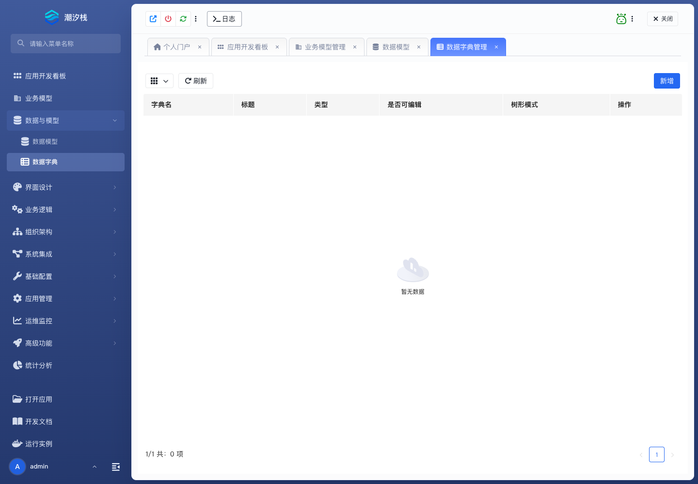

# 数据字典

## 功能简介

数据字典维护枚举、状态和分类选项，保证页面、模型和流程使用统一值域。

## 与其他模块的关系

- 业务字段、页面组件、筛选条件和流程判断都可以引用数据字典。
- 它能减少硬编码选项，也让多页面、多流程共享同一套状态口径。

## 如何操作

1. 进入“数据与模型 / 数据字典”。
2. 创建字典并维护字典项。
3. 在模型字段、页面组件或规则条件中选择对应字典。

## 截图

## 相关功能

- [业务模型](./business-model)
- [数据模型](./data-model)
