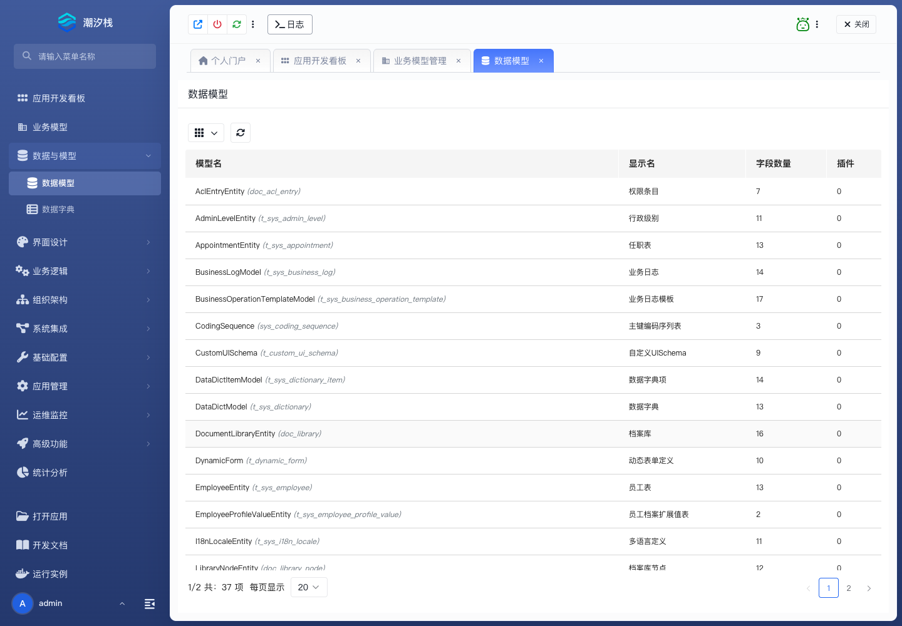

# 数据模型

## 功能简介

数据模型维护应用底层数据结构，是业务模型投射、接口和逻辑流数据处理的基础。

## 与其他模块的关系

- 业务模型可以基于数据模型投射生成或保持映射关系。
- 逻辑流、后端接口和数据源配置会依赖数据模型确定读写对象和字段结构。

## 如何操作

1. 进入“数据与模型 / 数据模型”。
2. 创建或维护数据模型字段。
3. 在业务模型、后端接口或逻辑流中引用数据模型。

## 截图

## 相关功能

- [业务模型](./business-model)
- [数据字典](./data-dictionary)
