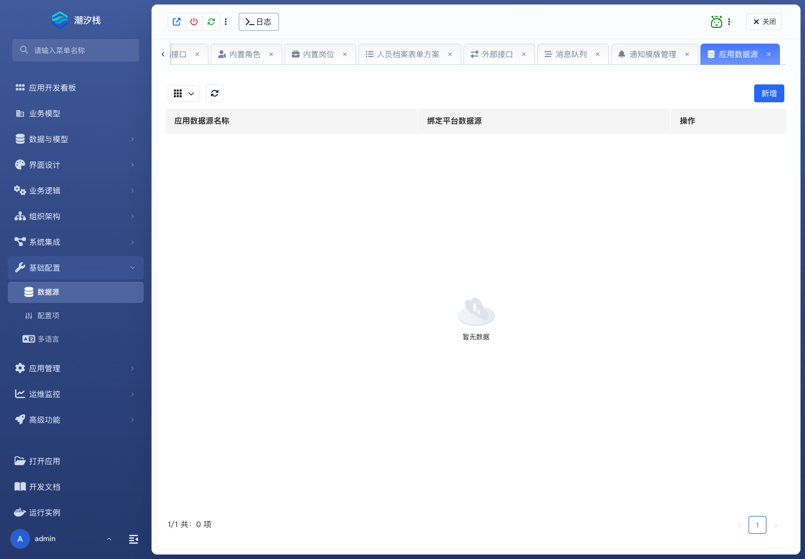

# 数据源

应用数据源为数据集、逻辑流等能力提供稳定的连接名称；实际 JDBC 连接由管理员在平台数据源中统一维护。

## 使用步骤

1. 管理员创建平台数据源，填写名称、标题、环境、JDBC 类型、驱动、URL、用户名和密码。
2. 应用开发者进入 **基础配置 / 数据源**，新建应用数据源名称。
3. 将应用数据源绑定到目标环境的平台数据源。
4. 在数据集、逻辑流或其他能力中引用应用数据源名称。

支持的驱动类型包括 MySQL、Oracle、PostgreSQL、KingbaseES 和 SQL Server。

成功标志：应用只引用应用数据源名；切换环境时由管理员调整绑定，不需要修改业务定义中的 JDBC 参数。

完整步骤见 [集成与定时自动化](../integration-and-scheduled-automation#绑定数据源)。
