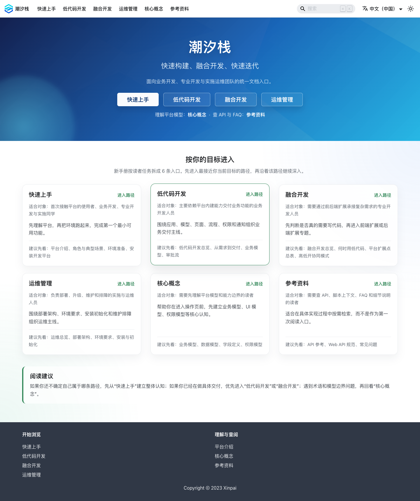

# 开发文档

## 功能简介

开发文档提供平台相关说明、操作指南和扩展参考。

## 与其他模块的关系

- 开发文档是辅助入口，不属于单个应用资产。
- 当业务模型、逻辑流、微前端或后端扩展包需要更详细说明时，可以从这里查找。

## 如何操作

1. 在应用开发工作区左侧菜单点击“开发文档”。
2. 进入平台文档入口。
3. 按主题查找操作说明或扩展指南。

## 截图

## 相关功能

- [运行实例](./runtime-instance)
