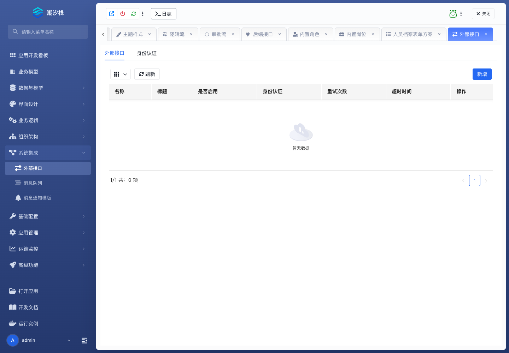

# 外部接口

外部接口用于通过 HTTP 调用第三方系统。先配置认证凭据，再配置接口。

## 使用步骤

1. 按外部系统要求创建 Access Token、明文凭据、HTTP Basic 或 AK/SK HMAC 认证。
2. 进入 **系统集成 / 外部接口**，新建接口。
3. 填写名称、标题、分组、描述、HTTP 方法和 URL。
4. 选择认证凭据，配置 header、query、body 或 cookie 参数。
5. 动态值使用 `${变量}`，平台配置值使用 `#{配置项}`。
6. 在高级设置中配置超时和重试，启用接口。
7. 在逻辑流中用已知输入调用，核对请求和响应。

成功标志：正确凭据可完成调用；认证失败、超时和非成功响应会进入明确的错误处理分支。

不要把密码、Token 或 AK/SK 直接写入逻辑流参数。
