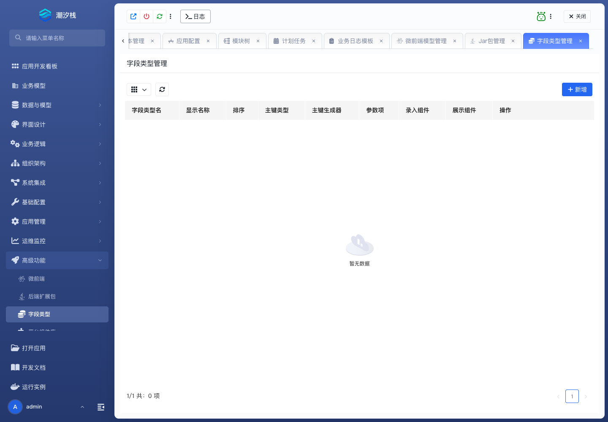

# 字段类型

## 功能简介

字段类型维护应用可用的扩展字段类型。

## 与其他模块的关系

- 字段类型会影响数据模型、业务模型、表单控件和运行时展示。
- 它通常与后端扩展包和平台组件库一起扩展字段能力。

## 如何操作

1. 进入“高级功能 / 字段类型”。
2. 维护字段类型。
3. 在模型字段设计时选择使用。

## 截图

## 相关功能

- [微前端](./micro-frontend)
- [后端扩展包](./backend-extension-package)
- [平台组件库](./component-library)
