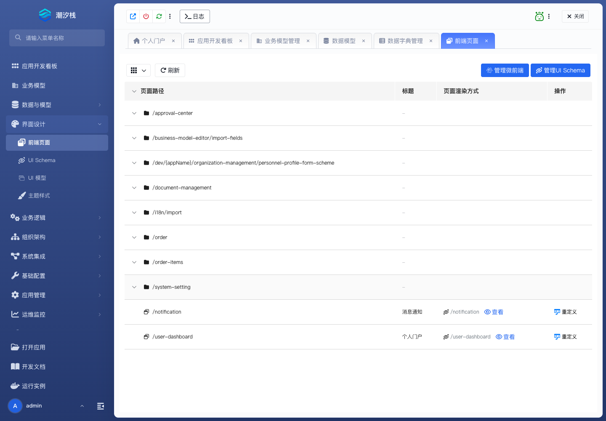

# 前端页面

## 功能简介

前端页面管理应用内页面入口，用于承载列表页、详情页、表单页和自定义页面。

## 与其他模块的关系

- 前端页面通常引用 UI Schema、UI 模型或业务模型标准页面。
- 它需要与模块树编排配合，才能把页面入口暴露给最终用户。

## 如何操作

1. 进入“界面设计 / 前端页面”。
2. 创建或维护页面。
3. 绑定页面实现后，在模块树编排中挂载入口。

## 截图

## 相关功能

- [UI Schema](./ui-schema)
- [UI 模型](./ui-model)
- [主题样式](./theme-style)
