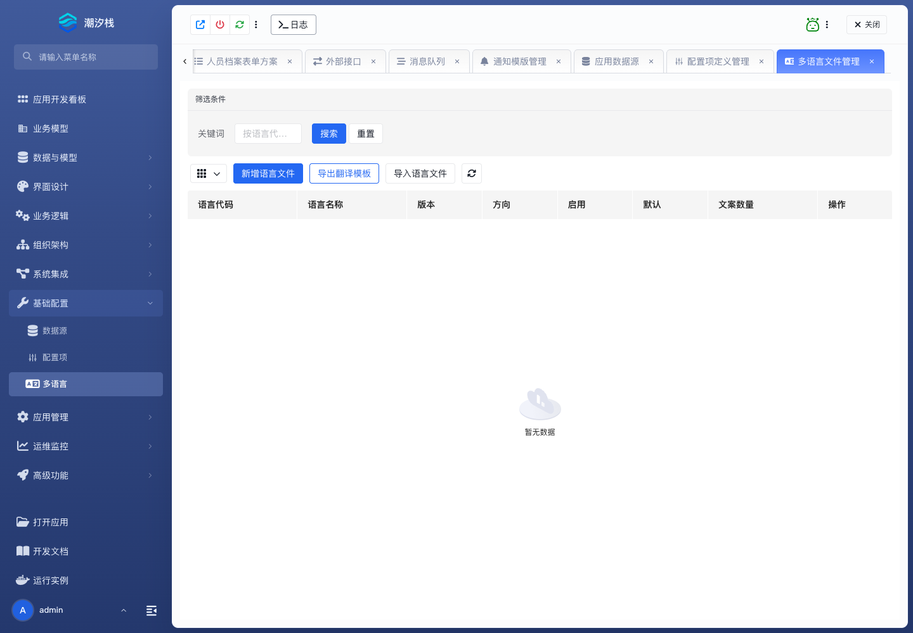

# 多语言

## 功能简介

多语言维护应用内国际化文案资源。

## 与其他模块的关系

- 多语言资源影响菜单、页面标题、按钮、提示和业务文案。
- 它与前端页面、UI Schema、模块树和平台组件库协同。

## 如何操作

1. 进入“基础配置 / 多语言”。
2. 维护语言键和值。
3. 在页面、菜单或组件中引用语言键。

## 截图

## 相关功能

- [数据源](./datasource)
- [配置项](./config-item)
