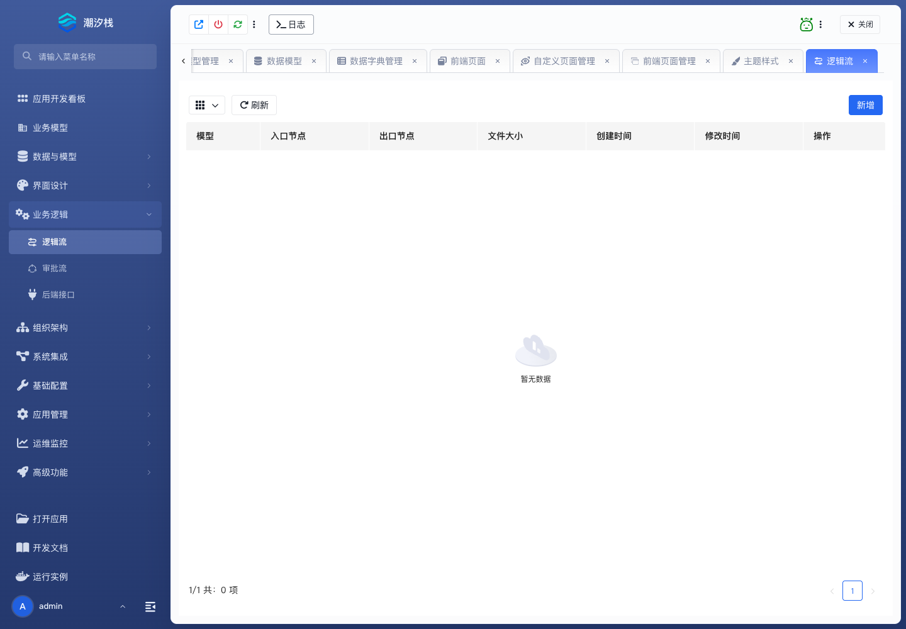

# 逻辑流

## 功能简介

逻辑流编排系统自动处理过程，例如映射、校验、分支、查询、写入和脚本节点。

## 与其他模块的关系

- 逻辑流可被后端接口、计划任务、业务动作和外部集成调用。
- 它常与数据模型、数据源、配置项、消息队列和通知模板组合。

## 如何操作

1. 进入“业务逻辑 / 逻辑流”。
2. 创建逻辑流并配置节点、端口和连线。
3. 在接口、任务或业务动作中引用逻辑流。

## 截图

## 相关功能

- [审批流](./approval-workflow)
- [后端接口](./backend-api)
