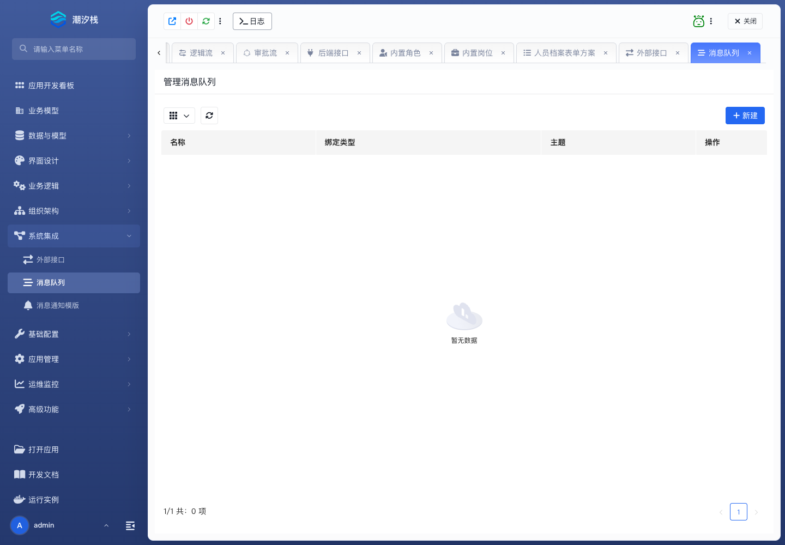

# 消息队列

消息队列为应用配置生产者或消费者绑定，默认适配 RabbitMQ。消费者把收到的消息交给逻辑流处理。

## 使用步骤

1. 进入 **系统集成 / 消息队列**，新建绑定。
2. 填写名称、描述，选择消费者或生产者。
3. 填写 Topic 或 Exchange；按中间件约定配置路由键或分区键、分组和 Binder 名。
4. 消费者选择处理消息的逻辑流。
5. 默认字段不够时填写自定义属性。
6. 提交更改；放弃修改时使用 **放弃变更并解锁**。
7. 发送一条带唯一标识的消息，核对入队、消费和业务结果。

成功标志：生产者成功投递；消费者实例已建立，唯一测试消息按设计处理一次。

正式环境巡检见 [任务、消息与实时链路维护](../../operations/task-message-and-realtime-link-maintenance#消息链路)。
