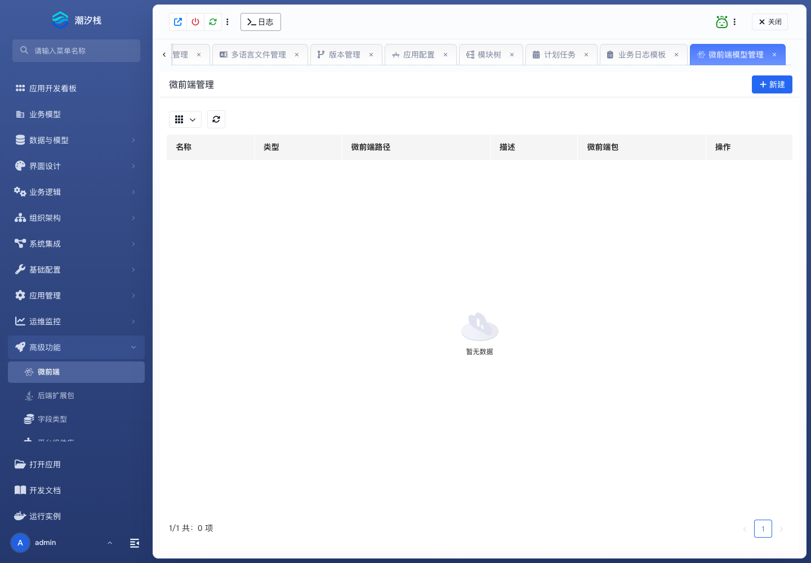

# 微前端

## 功能简介

微前端接入自定义前端应用，承接标准页面无法表达的复杂交互。

## 与其他模块的关系

- 微前端与模块树、前端页面、平台组件库和权限配置配合使用。
- 当 UI Schema 和标准组件不足时，它是进入融合开发的前端入口。

## 如何操作

1. 进入“高级功能 / 微前端”。
2. 配置微前端入口、路径和资源。
3. 在模块树中暴露微前端入口。

## 截图

## 相关功能

- [后端扩展包](./backend-extension-package)
- [字段类型](./field-type)
- [平台组件库](./component-library)
