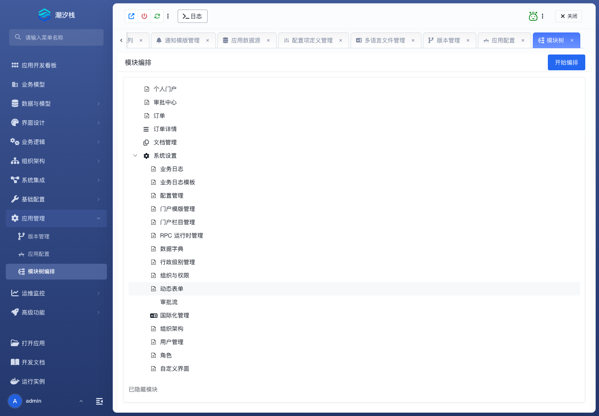

# 模块树编排

## 功能简介

模块树编排组织应用菜单、模块层级和最终用户入口。

## 与其他模块的关系

- 前端页面、业务模型、审批入口和自定义页面需要通过模块树暴露给用户。
- 它连接开发资产和运行态导航。

## 如何操作

1. 进入“应用管理 / 模块树编排”。
2. 创建、移动或配置模块节点。
3. 绑定页面、模型或业务入口。

## 截图

## 相关功能

- [版本管理](./version-management)
- [应用配置](./app-configuration)
