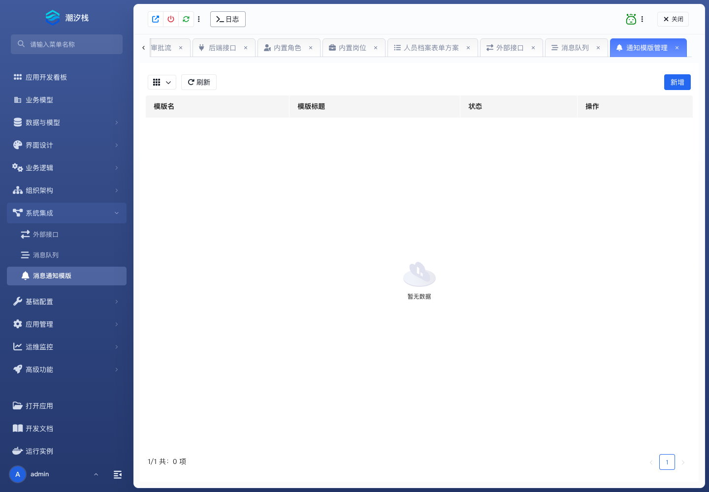

# 消息通知模版

## 功能简介

消息通知模版维护业务通知内容、参数和渠道使用方式。

## 与其他模块的关系

- 通知模板常被审批流、逻辑流、计划任务和状态变更事件触发。
- 它负责结果触达，不负责推进业务流程本身。

## 如何操作

1. 进入“系统集成 / 消息通知模版”。
2. 维护模板、参数和渠道。
3. 在流程、任务或业务动作中引用模板。

## 截图

## 相关功能

- [外部接口](./external-api)
- [消息队列](./message-queue)
