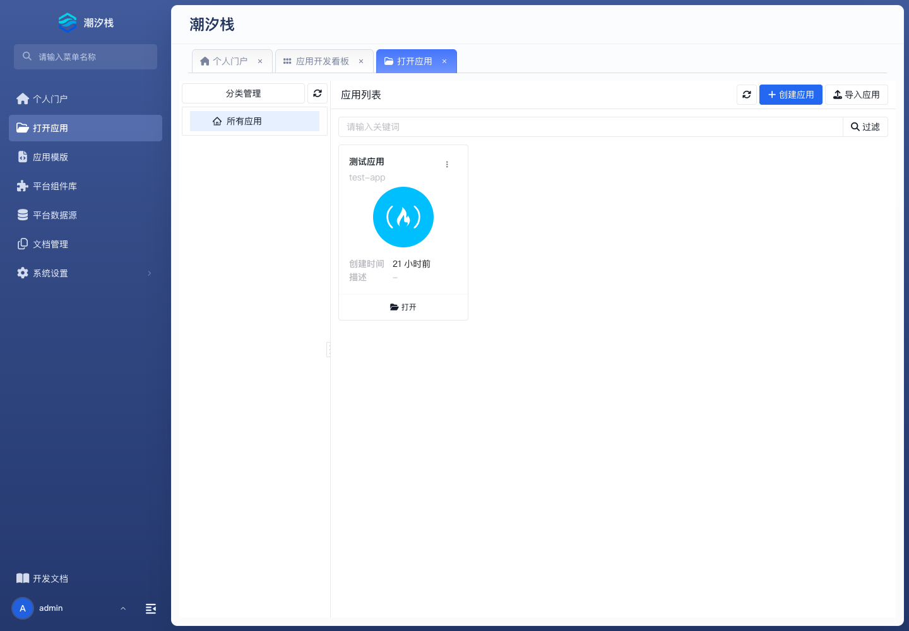

# 打开应用

## 功能简介

打开应用是进入开发工作区的入口，用于创建、导入、过滤和打开低代码应用。

## 与其他模块的关系

- 应用打开后会切换到应用开发看板，后续业务模型、页面、流程、接口、组织、集成和运维菜单都围绕该应用工作。
- 它也是从平台门户进入具体应用开发态的边界，和运行实例、版本管理一起形成“开发到运行”的入口链路。

## 如何操作

1. 在平台侧边栏点击“打开应用”。
2. 通过筛选或应用卡片找到目标应用。
3. 点击应用卡片中的“打开”，进入该应用的开发工作区。

## 截图

## 相关功能

- [应用开发看板](./app-dashboard)
