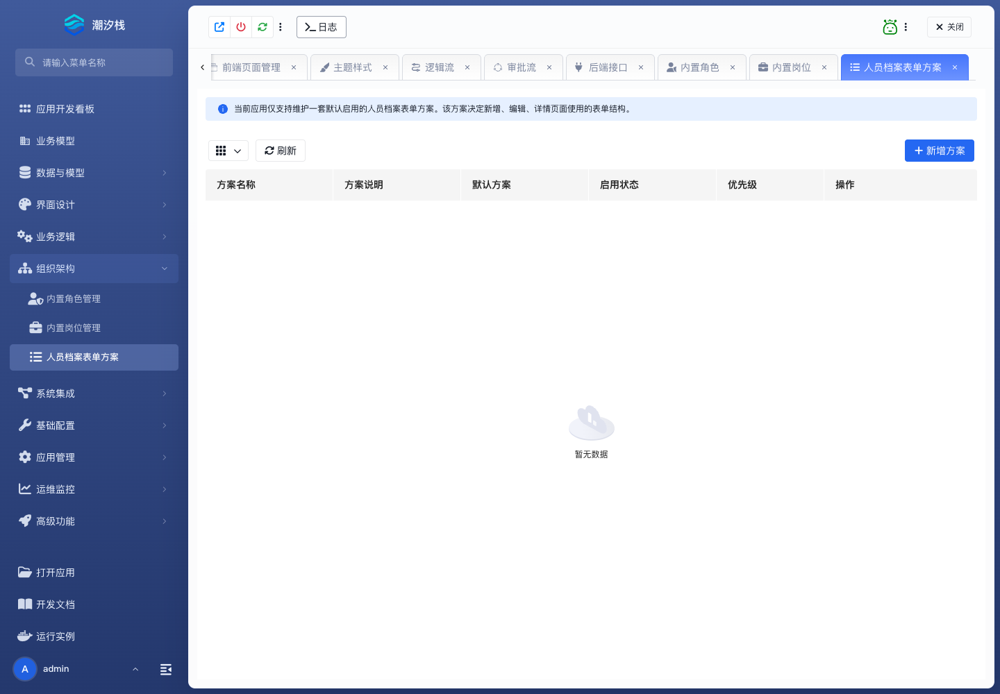

# 人员档案表单方案

## 功能简介

人员档案表单方案配置人员档案的采集和展示结构。

## 与其他模块的关系

- 它连接组织架构、岗位、角色和人员信息字段。
- 当人员信息需要超出默认字段时，可通过表单方案扩展。

## 如何操作

1. 进入“组织架构 / 人员档案表单方案”。
2. 维护档案字段和表单方案。
3. 在人员信息维护页面中使用该方案。

## 截图

## 相关功能

- [内置角色管理](./builtin-role)
- [内置岗位管理](./builtin-position)
