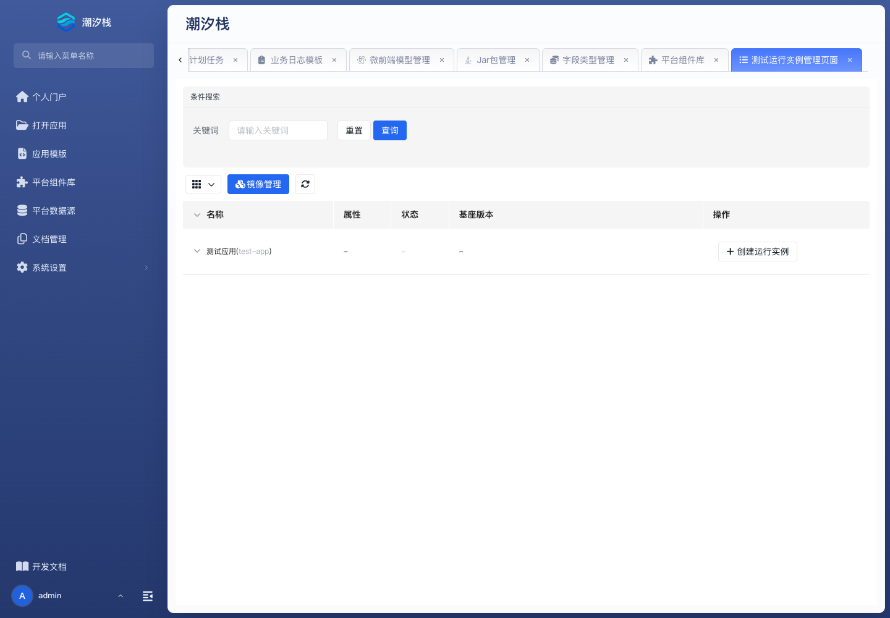

# 运行实例

运行实例用于从开发工作区生成并控制测试应用容器，入口为 `/container-management`。

## 创建实例

1. 打开 **运行实例**，在目标应用下点击 **创建运行实例**。
2. 选择基座镜像和环境。
3. Docker 运行方式下配置 Web 端口；需要调试时再配置调试端口。
4. 选择默认、内存或跟随环境的数据源。
5. 按需要配置 Xms、Xmx 和自定义环境变量。
6. 核对 **重新初始化** 和 **重置配置文件**；前者可能删除并重建数据库。
7. 创建并启动实例，打开应用完成登录和核心功能验证。

成功标志：实例状态为运行，端口可访问，应用连接到预期数据源，日志没有持续启动错误。

## 控制实例

按状态可执行启动、暂停、恢复、强制停止、重启、删除和更新镜像。**更新镜像** 更换运行基座镜像，不会把应用元数据自动切换到版本管理中的某个 tag。

:::warning
重新初始化可能删除并重建实例数据库。执行前确认实例用途、备份和允许丢失的数据范围。
:::

该能力服务于开发工作区的测试运行，不等同于完整的生产部署系统。发布和回退边界见 [应用发布与回退](../../operations/application-release-and-rollback)。
