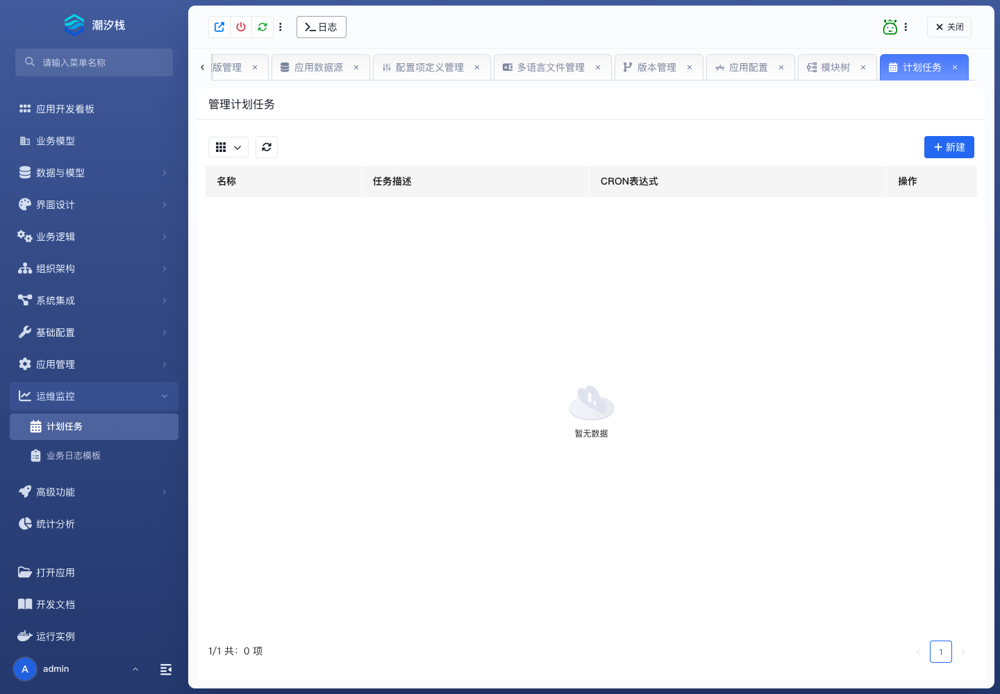

# 计划任务

计划任务按 Quartz Cron 周期触发逻辑流，适合定时同步、批处理、巡检和提醒。一次性调度由程序 API 提供，不在本页面创建。

## 使用步骤

1. 先创建并验证承担业务处理的逻辑流。
2. 进入 **运维监控 / 计划任务**，新建任务。
3. 填写名称、任务描述、Quartz Cron 表达式、逻辑流和 JSON 任务数据。
4. 编辑前取得锁；页面出现 `*` 表示存在未提交更改。
5. 提交更改并等待一个触发周期。
6. 检查逻辑流收到的任务数据和最终业务结果。
7. 不保留修改时点击 **放弃变更并解锁**。

成功标志：任务按预期时区触发，JSON 数据以 Map 形式传入逻辑流，业务侧能核对本次执行结果。

正式环境巡检见 [任务、消息与实时链路维护](../../operations/task-message-and-realtime-link-maintenance#调度链路)。
