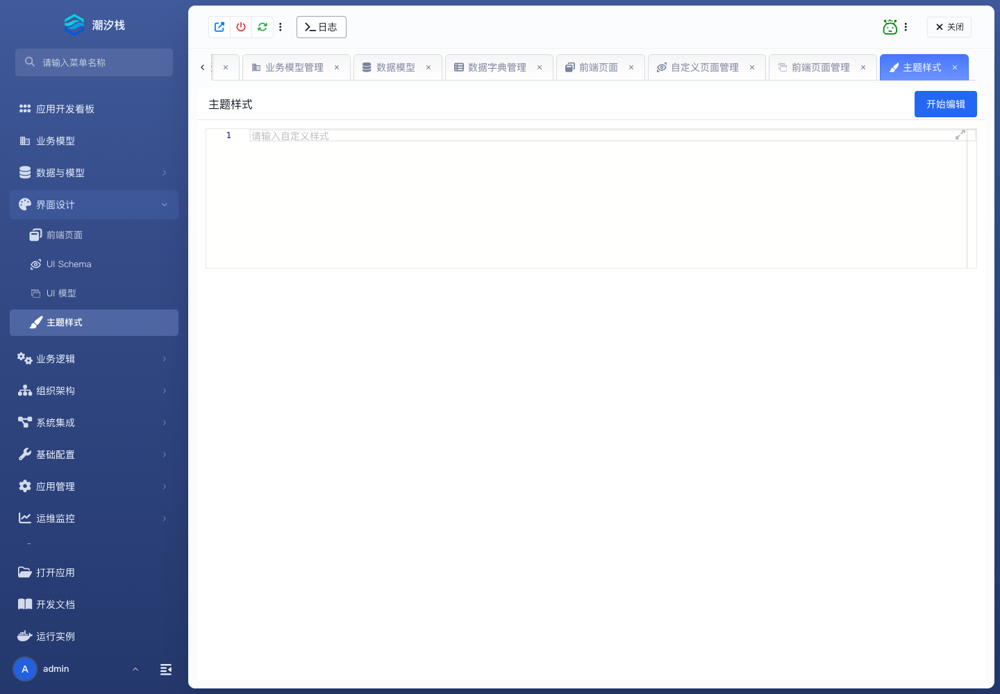

# 主题样式

## 功能简介

主题样式维护应用级视觉配置和样式覆盖。

## 与其他模块的关系

- 主题样式影响前端页面、UI Schema、UI 模型和运行实例中的最终展示。
- 通常在模型、页面和模块树基本稳定后统一调整。

## 如何操作

1. 进入“界面设计 / 主题样式”。
2. 配置应用样式或视觉覆盖。
3. 通过运行实例检查最终效果。

## 截图

## 相关功能

- [前端页面](./frontend-page)
- [UI Schema](./ui-schema)
- [UI 模型](./ui-model)
