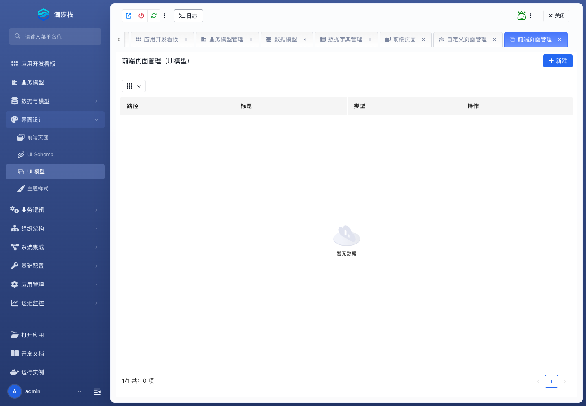

# UI 模型

## 功能简介

UI 模型用于沉淀可复用界面资产，比单个 UI Schema 更偏模型化和复用。

## 与其他模块的关系

- UI 模型可以服务多个页面或业务场景。
- 它与 UI Schema、前端页面和平台组件库协同，降低重复页面配置成本。

## 如何操作

1. 进入“界面设计 / UI 模型”。
2. 维护界面模型。
3. 在页面或业务模型中引用并复用。

## 截图

## 相关功能

- [前端页面](./frontend-page)
- [UI Schema](./ui-schema)
- [主题样式](./theme-style)
