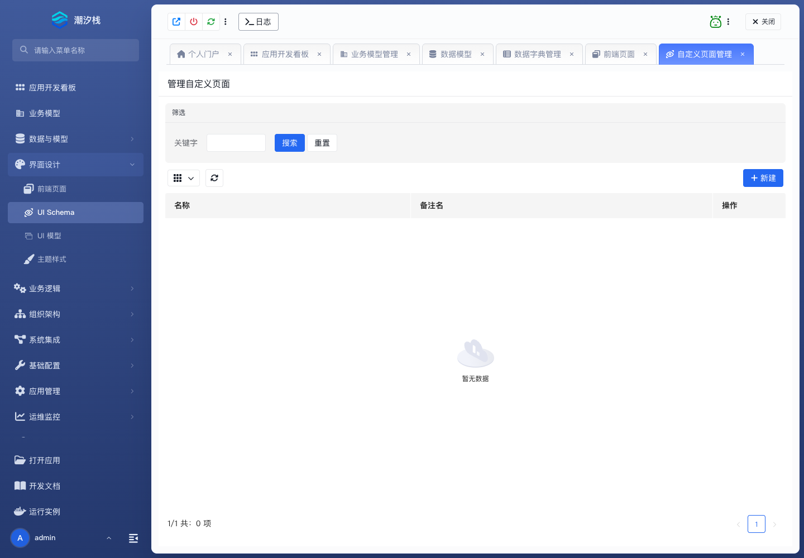

# UI Schema

**UI Schema** 菜单打开 **管理自定义页面**，用于按页面路径覆盖已有 Schema，或为新路径提供 Schema。

## 使用步骤

1. 新建记录并填写完整页面路径。
2. 覆盖已有页面时使用完全相同的路径，点击 **拉取页面** 取得现有 Schema。
3. 使用可视化编辑或代码编辑调整组件、布局、数据接口和动作。
4. 保存并开启 **启用**。
5. 打开目标路径，验证加载、查询、提交和错误提示。

成功标志：启用后目标路径使用自定义 Schema；关闭后恢复原解析结果。

新增路径不会自动进入导航，还要通过 UI 模型或菜单提供入口。完整步骤见 [页面交付方案](../page-delivery-with-dynamic-forms-and-ui-schema#覆盖或新增-ui-schema)。
