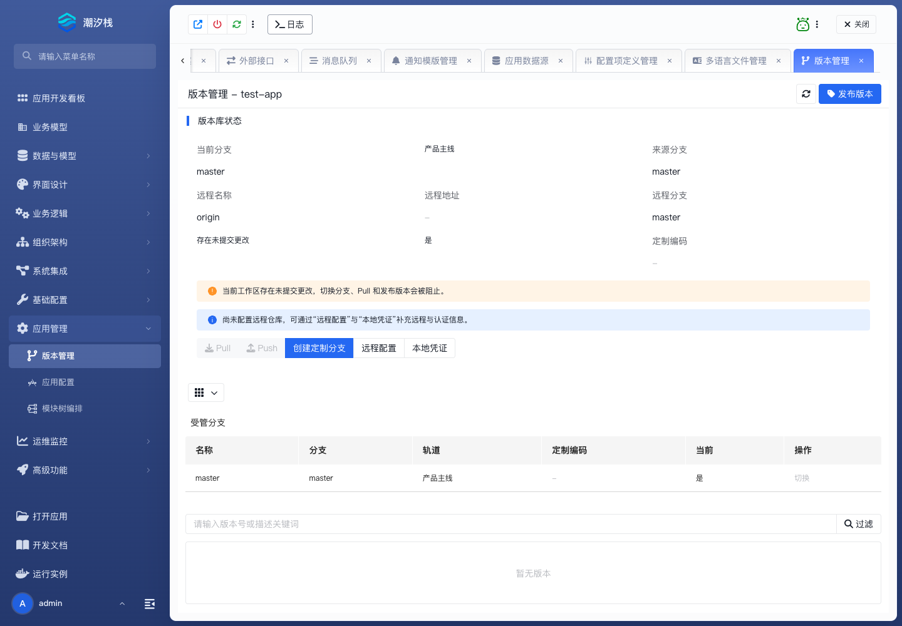

# 版本管理

版本管理用于冻结应用元数据快照。发布版本会创建逻辑版本对应的 Git tag，并可导出 ZIP；它不负责把运行实例直接切换到某个旧版本。

## 发布版本

1. 进入 **应用管理 / 版本管理**，确认当前工作区没有未提交更改。
2. 点击 **发布版本**。
3. 填写唯一的逻辑版本号，建议采用 `v1.0.0` 格式，并填写版本描述。
4. 发布后刷新列表，确认版本记录和 tag 已生成。
5. 导出 ZIP，在隔离目录检查快照内容可解压且信息完整。

成功标志：工作区保持干净，版本记录与 tag 一致，导出的 ZIP 可用于留档或独立恢复演练。

当前页面没有“选择旧版本并让现有运行实例一键回滚”的操作。业务应用发布与恢复见 [应用发布与回退](../../operations/application-release-and-rollback)。
